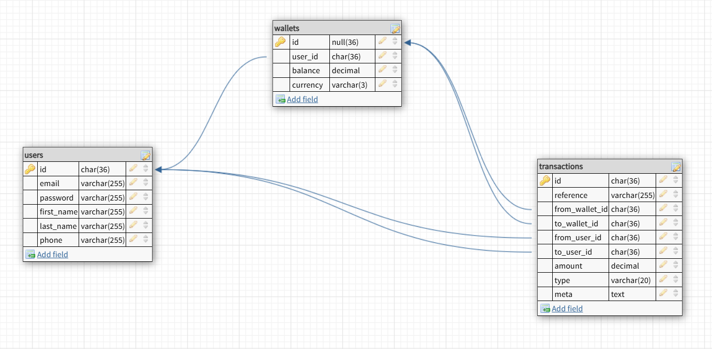

# 💰 Demo Credit Wallet Service

Demo Credit is a **mobile lending app** built with a wallet system that enables users to receive, hold, transfer, and withdraw funds.

It forms the financial backbone of a lending platform where loan disbursements and repayments are processed via user wallets.

This project was built focusing on wallet operations, blacklist verification, and transactional integrity.

---

## 🚀 Features

- **User Onboarding**
  - Create an account and a wallet for the user.
  - Prevent onboarding for blacklisted users via the **Lendsqr Adjutor Karma API**.
- **Wallet Funding**
  - Credit wallet balance - deposit or loan disbursement.
- **Funds Transfer**
  - Send money between registered users’ wallets.
  - Atomic transaction handling ensures consistency.
- **Withdrawal**
  - Debit wallet balance - repayment or cash withdrawal.
- **Balance Inquiry**
  - Fetch real-time wallet balance.
- **Service-level Unit Tests**
  - Each business operation (funding, transfer, withdrawal) is unit tested.

---

## 🧱 Tech Stack

- **Runtime** - Node.js (LTS)
- **Framework** - NestJS
- **Language** - TypeScript
- **ORM / Query Builder** - Knex.js
- **Database** - MySQL
- **HTTP Client** - Axios (for Adjutor Karma API)
- **Testing** - Jest
- **Authentication** - JWT

---

## 🧩 Database Design

Below is the Entity-Relationship Diagram for the Demo Credit application:



---

## 🔌 Setup Instructions

### 1. Clone Repository

`git clone https://github.com/vincentabolarin/demo-credit.git`

### 2. Install Dependencies

`npm install`

### 3. Configure Environment

- Create a `.env` file at the root of the project:

```
DB_CLIENT=mysql
DB_HOST=localhost
DB_PORT=3306
DB_USER=root
DB_PASSWORD=password
DB_NAME=demo_credit_db
KARMA_API_BASE_URL=https://api.adjutor.lendsqr.com
KARMA_API_KEY=your_adjutor_api_key
PORT=3000
```

### 4. Run Migrations

`npx knex migrate:latest`

### 5. Start the Server

`npm run start:dev`

### 6. Run Unit Tests

`npm run test`

---

## 🔍 Example API Endpoints

### POST /auth/signup

Create a new user and wallet

### POST /wallets/fund

Fund wallet

### POST /wallets/transfer

Transfer funds

### POST /wallets/withdraw

Withdraw funds

### GET /wallets/mine

Get logged-in user's wallet

---

## 📃 Full Postman Documentation

https://documenter.getpostman.com/view/29041245/2sB3QRp7af

---

## 🧠 Key Design Considerations

### Atomic Transactions:

Wallet operations use database transactions to ensure data consistency.

### Blacklist Protection:

Integration with Adjutor Karma API ensures no blacklisted user can onboard.

### Validation and Error Handling:

Centralized response interceptor and exception filter.

### Test Coverage:

Focused on service-level business logic.

---

## 🧾 License

This project was developed by Vincent Abolarin.
All rights reserved © 2025
Demo Credit Wallet.

---

## 💡 Author Vincent Abolarin

Senior Software Engineer
[LinkedIn](https://www.linkedin.com/in/vincentabolarin) · [GitHub](https://www.github.com/vincentabolarin)
